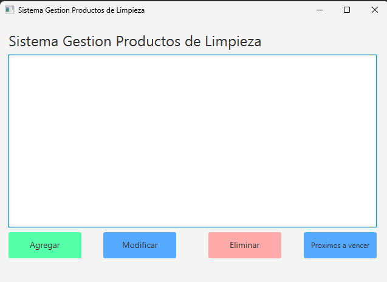
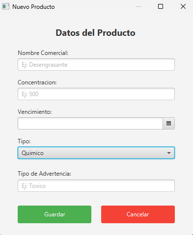
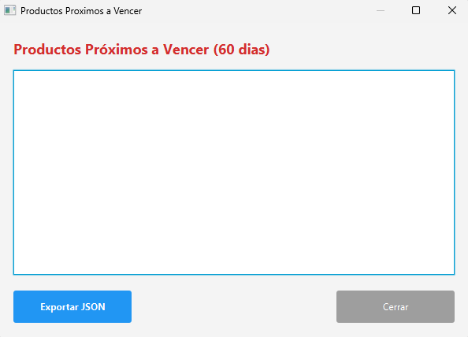

# Sistema de Gestión de Productos de Limpieza

## Descripción
Este proyecto es una aplicación de escritorio desarrollada en Java que permite la gestión integral de un inventario de productos de limpieza. La aplicación está diseñada para facilitar el control de stock, la administración de fechas de vencimiento y la categorización de productos (químicos, ecológicos, etc.).

## Características Principales
- **Gestión de Inventario**: Alta, baja y modificación de productos.
- **Control de Vencimientos**: Alertas visuales para productos próximos a vencer.
- **Clasificación**: Soporte para diferentes categorías de productos.
- **Interfaz Gráfica**: Interfaz moderna y amigable construida con JavaFX.
- **Persistencia**: Almacenamiento de datos mediante archivos JSON.

## Capturas de Pantalla

### Pantalla Principal

### Formulario de Registro

### Alertas de Vencimiento

## Tecnologías Utilizadas
- **Java 21+**: Lenguaje principal del proyecto.
- **JavaFX**: Framework para la construcción de la interfaz gráfica.
- **Gson**: Librería de Google para la serialización y deserialización de objetos Java a JSON.
- **NetBeans**: Entorno de desarrollo integrado (IDE).

## Instalación y Ejecución
1. Clonar el repositorio.
2. Abrir el proyecto en NetBeans (o tu IDE de preferencia con soporte para Ant/Maven/Gradle según corresponda).
3. Asegurarse de tener configurado el JDK 21 o superior.
4. Ejecutar la clase principal `sistemagestionproductoslimpieza.models.SistemaGestionProductosLimpieza`.

## Estructura del Proyecto
El código fuente se encuentra organizado en paquetes estándar bajo `src/sistemagestionproductoslimpieza`.